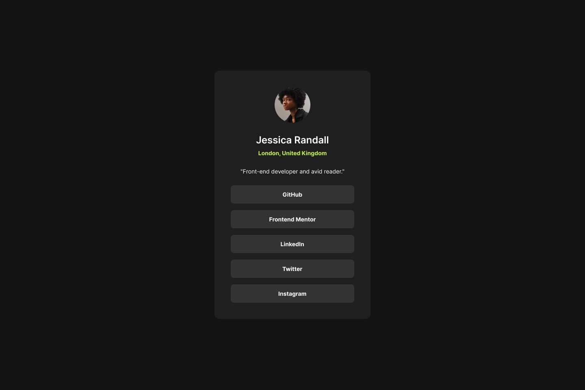

# Projeto Mentor Frontend - Perfil de links sociais

## Bem-vindo! 👋

Obrigado por conferir este desafio de codificação front-end.

Os desafios do [Frontend Mentor](https://www.frontendmentor.io) ajudam você a melhorar suas habilidades de codificação criando projetos realistas.

**Para fazer este desafio, foi necessário um conhecimento básico de HTML e CSS.**

## O desafio

O desafio foi construir esse perfil de links sociais e fazer com que pareça o mais próximo possível do design.

Os usuários devem ser capazes de:

- Ver os estados de foco para todos os elementos interativos na página

